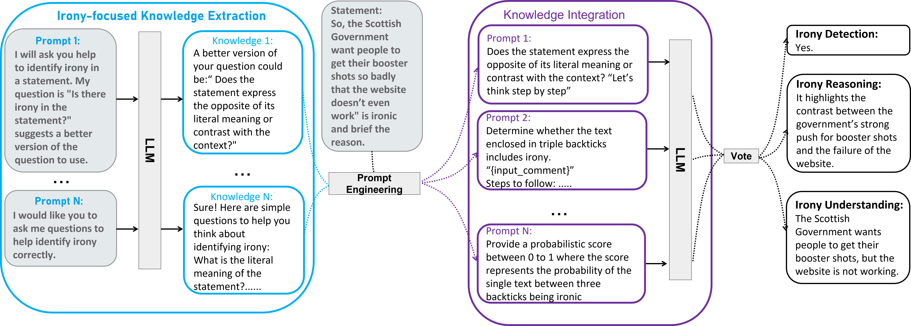

# Irony Detection, Reasoning and Understanding in Zero-shot Learning
**Implementation of paper: Irony Detection, Reasoning and Understanding in Zero-shot Learning**

Irony is a powerful figurative language (FL) on social media that can potentially mislead various NLP tasks, such as recommendation systems, misinformation checks, and
sentiment analysis. Understanding the implicit meaning of this kind of subtle language is an essential step to mitigate the negative impact of irony in NLP tasks. However, existing efforts are limited
to domain-specific datasets and struggle to generalise across diverse real-world scenarios. Moreover, the reasoning for model decisions that accurately capture semantic and affective meaning
remains underexplored. To address these limitations, this paper proposes a conceptual framework called IDADP, which leverages Large language models(LLMs)’ in-context learning capabilities to detect irony and generate human-like explanations across diverse datasets and platforms without prior training on ironic samples

## Main idea and implementation
In the **Irony-focused Knowledge Extraction stage**, multiple prompts are used to elicit different aspects of irony-related knowledge from the language model. The **Knowledge Integration stage** incorporates
this knowledge into targeted prompts designed for specific tasks. The outputs are then aggregated using a **voting mechanism** to produce the final results for irony detection (binary classification), irony reasoning (explanation of contrast or context), and irony understanding (interpretation of the ironic statement).

## Datasets 
#### [1] iSarcasm
I. A. Farha, S. Oprea, S. Wilson, and W. Magdy, “Semeval-2022 task 6:isarcasmeval, intended sarcasm detection in english and arabic,” in The 16th International Workshop on Semantic Evaluation 2022. Association
for Computational Linguistics, 2022, pp. 802–814.
#### [2] SemEval
C. Van Hee, E. Lefever, and V. Hoste, “Semeval-2018 task 3: Irony detection in english tweets,” in Proceedings of the 12th international workshop on semantic evaluation, 2018, pp. 39–50.
#### [3] Reddit
B. C. Wallace, L. Kertz, E. Charniak et al., “Humans require context to infer ironic intent (so computers probably do, too),” in Proceedings of the 52nd Annual Meeting of the Association for Computational Linguistics (Volume 2: Short Papers), 2014, pp. 512–516.
#### [4] Gen, RQ, HYP 
S. Oraby, V. Harrison, L. Reed, E. Hernandez, E. Riloff, and M. Walker, “Creating and characterizing a diverse corpus of sarcasm in dialogue,” arXiv preprint arXiv:1709.05404, 2017.

### Python package version
* pandas==2.0.3
* scikit_learn=1.2.2
* torch==2.3.1+cu121
* numpy==1.25.2
* transformers==4.40.0
* datasets==2.18.0
* python==3.10.12
* json==2.0.9
* nltk==3.8.1
* huggingface_hub==0.22.2
* psutil==5.3.0
