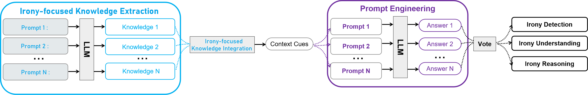

# Irony Detection, Reasoning and Understanding in Zero-shot Learning
Implementation of paper: Irony Detection, Reasoning and Understanding in Zero-shot Learning

Irony is a powerful figurative language (FL) on social media that can potentially mislead various NLP tasks, such as recommendation systems, misinformation checks, and
sentiment analysis. Understanding the implicit meaning of this kind of subtle language is an essential step to mitigate the negative impact of irony in NLP tasks. However, existing efforts are limited
to domain-specific datasets and struggle to generalise across diverse real-world scenarios. Moreover, the reasoning for model decisions that accurately capture semantic and affective meaning
remains underexplored. To address these limitations, this paper proposes a conceptual framework called IDADP, which leverages Large language models(LLMs)’ in-context learning capabilities to detect irony and generate human-like explanations across diverse datasets and platforms without prior training on ironic samples

## Main idea and implementation
In the **Irony-focused Knowledge Extraction stage**, multiple prompts are used to elicit different aspects of irony-related knowledge from the language model. The **Knowledge Integration stage** incorporates
this knowledge into targeted prompts designed for specific tasks. The outputs are then aggregated using a **voting mechanism** to produce the final results for irony detection (binary classification), irony reasoning (explanation of contrast or context), and irony understanding (interpretation of the ironic statement).

## Datasets 
#### [1] Instagram cyberbullying detection datasets （Need to request from the dataset author）
Homa Hosseinmardi, Sabrina Arredondo Mattson, Rahat Ibn Rafiq, Richard Han, Qin Lv, and Shivakant Mishra. 2015. **Analyzing labeled cyberbullying incidents on the instagram social network**. In _Socinfo_. Springer, 49–66.
#### [2] Vine cyberbullying detection datasets （Need to request from the dataset author）
Rahat Ibn Rafiq, Homa Hosseinmardi, Richard Han, Qin Lv, Shivakant Mishra, and Sabrina Arredondo Mattson. 2015. **Careful what you share in six seconds: Detecting cyberbullying instances in Vine**. In _ASONAM_. ACM, 617–622.
#### [3] Swear lexicon_1 (Publicly available)
Agrawal S, Awekar A. 2018 Mar 1. **Deep learning for detecting cyberbullying across multiple social media platforms**. In European conference on information retrieval 2018 Mar 1 (pp. 141-153). 
#### [4] Swear lexicon_2 (Publicly available)
We use Google bad words lists[https://code.google.com/archive/p/badwordslist/downloads]

### Python package version
* pandas==2.0.3
* scikit_learn=1.2.2
* torch==2.3.1+cu121
* numpy==1.25.2
* transformers==4.40.0
* datasets==2.18.0
* python==3.10.12
* json==2.0.9
* nltk==3.8.1
* huggingface_hub==0.22.2
* psutil==5.3.0
